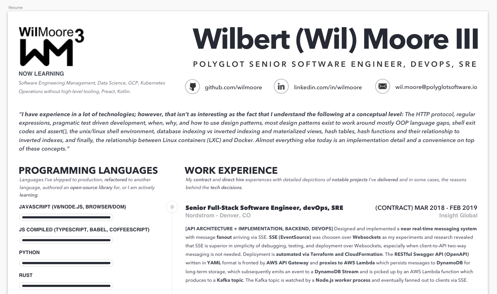

# Resume of [Wilbert (Wil) Moore III][Wilbert (Wil) Moore III on LinkedIn] in `Sketch.app`
> To all of my technical recruiter friends; this is why I am unable to provide you with a Microsoft Word version of my resume...it simply doesn't exist.

## Why a vector graphics program?
You might be wondering why a software engineer would choose to weild a vector graphics program to edit his resume. Why not just use Microsoft Word? The reason is simple...only a vector graphics editor is going to provide the level of specificity that I desire in building such an important document. The livelyhood of my family rests _mostly_ on my shoulders; thus, I've choosen to be especially careful to use the right tool. My first two professional jobs while at [CSULB][] were as a desktop publisher. I essentially grew up on Macromedia Freehand, Adobe Illustrator, Adobe PageMaker, and QuarkXPress.

## Why Sketch?
- `Sketch.app` is affordable relative to other such programs.
- `Sketch.app` feels lightweight and performant.
- `Sketch.app` developers seem to understand what good UX should be.
- `Sketch.app` is programmable and thus there are several useful, free plugins available.
- `Sketch.app` is provides almost everything I've always wished the programs above had ... for example, a sane scripting engine.
- As a [contrator for a huge part of my career][The Nomadic Developer], recruiters generally need specific edits per their corporate policies and there are a few conveniences within `Sketch.app` (provided by plugins) that are not available anywhere else.
- I am already using `Sketch.app` for software prototyping, mocks, and diagrams so it made sense to use this opportunity to get a bit more intimate with the program that I'm planning to rely on professionally for the foreseable future.

I've tried using other vector graphics programs for writing my resume. I've had moderate success with `Adobe Illustrator` and `Affinity Designer`; however, even these amazing programs fail to provide the level of flexible organization and scriptability provided in `Sketch.app`.

## Why put all this work into a document?
Simple; I enjoy the process. Furthermore, this is a document that will follow me for the rest of my career. I have had trouble in the past recalling the different projects I've worked on and it's somewhat gratifying to see it all (most of it) in a single document. The list of skills will evolve over time as new technologies render older technologies useless or irrelevant; however, there are some mainstays and those are worth documenting.

## Organization
`Sketch.app` is flexible enough to allow several different organization strategies. This `.sketch` file is organized at the highest level using pages (i.e. `Page 1`, `Page 2`, `Page N`), then each page is organized as follows:

- **Artboard** (`name:` _Resume_)
- **Layer Groups**
  - **TOP** (`LOCKED`)
  - **MIDDLE** (`LOCKED`)
  - **BOTTOM** (`LOCKED`)

There are several **Layer Groups** nested under `TOP`, `MIDDLE`, and `BOTTOM`; however, you'll have to open the `.sketch` file to discover those as those could changes slightly over time and I'd prefer not to have to update this above to accomodate.

## Plugins Used
- [annotations-sketch-plugin][]: used to hide/show recruiting firm as certain recruiting firms do not want to pass that info their their end-client (they can be a bit paranoid...I've never seen a client try to circumvent the system)

## Want to steal this?
Sure, go ahead and fork this repo and make it your own. You don't have to give me any attribution or anything like that...that would be a bit tacky and this resume is supposed to be elegant, so enjoy.

[The Nomadic Developer]: https://amzn.to/2C1gqlt
[Wilbert (Wil) Moore III on LinkedIn]: https://linkedin.com/in/wilmoore
[annotations-sketch-plugin]: https://github.com/BaguetteEngineering/annotations-sketch-plugin
[CSULB]: https://www.csulb.edu
